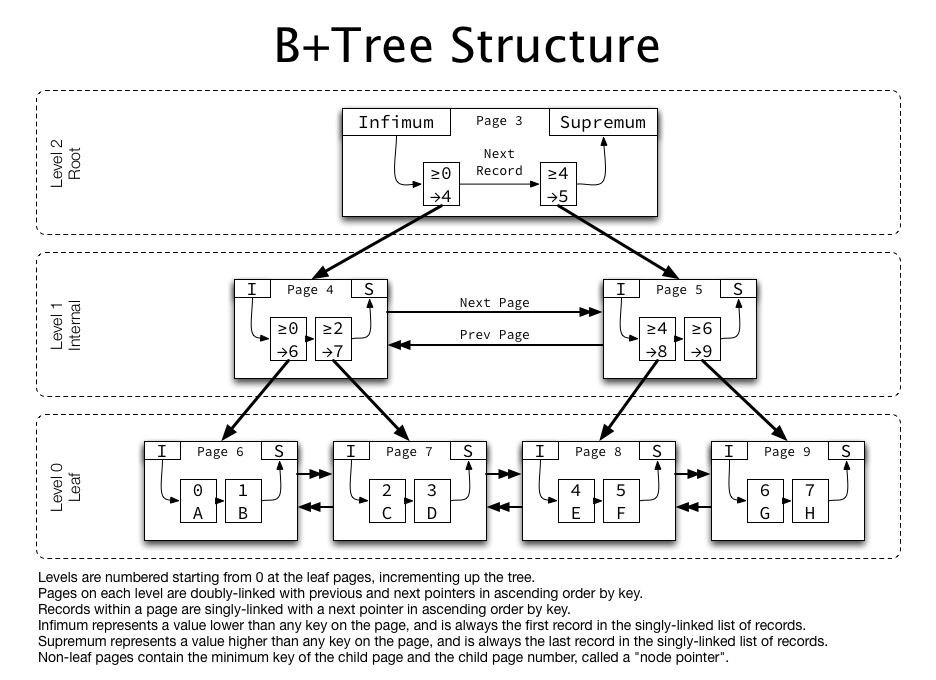

# index란 무엇인가요?

## 면접용 답변
인덱스는 데이터베이스에서 검색 속도를 높이기 위해 사용하는 자료 구조입니다. 
인덱스를 사용하면 테이블 전체를 스캔하지 않고도 조건에 맞는 데이터를 빠르게 조회할 수 있습니다.

 

## 개념 설명

### 인덱스란?

추가적인 쓰기 작업과 저장 공간을 활용하여 데이터베이스 테이블의 검색 속도를 향상시키기 위한 자료구조

- 장점
  - 테이블을 조회하는 속도와 그에 따른 성능을 향상시킬 수 있음
  - 전반적인 시스템 부하를 줄일 수 있음
- 단점 
  - 인덱스를 관리하기 위헤 DB의 약 10%에 해당하는 저장 공간 필요
  - 인덱스를 관리하기 위한 추가 작업 필요
  - 인덱스를 잘못 사용할 경우 오히려 성능이 저하됨
    
   

> _✏️ 성능이 저하되는 이유_   
DBMS는 index를 항상 최신의 정렬된 상태로 유지해야 원하는 값을 빠르게 탐색할 수 있음  
➡️ 인덱스가 적용된 컬럼에 INSERT, UPDATE, DELETE가 수행된다면 각각 다음과 같은 연산을 추가적으로 해주어야 하며 그에 따른 오버헤드가 발생
   INSERT: 새로운 데이터에 대한 인덱스를 추가함
  DELETE: 삭제하는 데이터의 인덱스를 사용하지 않는다는 작업을 진행함
  UPDATE: 기존의 인덱스를 사용하지 않음 처리하고, 갱신된 데이터에 대해 인덱스를 추가함
    ➡️  CREATE, DELETE, UPDATE가 빈번한 속성에 인덱스를 걸게 되면 인덱스의 크기가 비대해져서 성능이 오히려 저하되는 역효과가 발생

 

### 인덱스 자료 구조

#### Hash table

해시 테이블 기반의 DB 인덱스는 (데이터=컬럼의 값, 데이터의 위치)를 (Key, Value)로 사용하여 컬럼의 값으로 생성된 해시를 통해 인덱스를 구현

시간복잡도 O(1) == 매우 빠른 검색 지원

**BUT** 해시는 등호 연산(=)에 특화되어 있기 때문에 DB 인덱스에서 잘 쓰이지 않음   
데이터베이스에서는 부등호 연산이 자주 사용되기 때문~

그럼 뭘 쓰냐! B+Tree 씀

 

#### B+Tree

자식 노드가 2개 이상인 B-Tree를 개선시킨 자료구조  
BTree의 리프노드들을 LinkedList로 연결하여 순차검색을 용이하게 하는 등 BTree를 인덱스에 맞게 최적화한 것이 B+Tree

- 리프노드(데이터노드)만 인덱스와 함께 데이터(Value)를 갖고 있고, 나머지 노드(인덱스노드)들은 데이터를 위한 인덱스(Key)만을 갖음.
- 리프노드들은 LinkedList로 연결
- 데이터 노드 크기는 인덱스 노드의 크기와 같지 않아도 됨

시간 복잡도는 O(𝑙𝑜𝑔2𝑛)잊디만, 부등호 연산히 가능하기 때문에 해시테이블보다 인덱싱에 적합 

  

### * 인덱스를 왜 쓰나요?

인덱스는 검색 속도를 높이기 위해 사용합니다. 
테이블의 특정 컬럼에 인덱스를 설정하면 전체 테이블을 검색하는 것보다 훨씬 빠르게 데이터를 찾을 수 있습니다.

 

### * 인덱스가 항상 좋은 건가요?

아닙니다. 인덱스는 조회 성능을 높여주지만, 단점도 존재합니다.

대표적인 단점으로는 쓰기 성능 저하가 있습니다. 
새로운 데이터를 추가하거나 수정할 때 인덱스도 함께 갱신해야 하기 때문입니다.

또한, 인덱스는 저장 공간을 차지하기 때문에 너무 많은 인덱스를 만들면 오히려 성능이 악화될 수 있습니다.

 

### * 인덱스 종류에는 뭐가 있나요?

인덱스는 크게 B-Tree 기반 인덱스와 Hash 인덱스로 나뉩니다.
가장 많이 사용하는 건 B-Tree 인덱스로, 일반적인 WHERE 조건, ORDER BY, JOIN을 빠르게 처리할 수 있습니다.

MySQL 기준으로 인덱스 종류를 말씀드리자면,  
우선 B-Tree 기반으로 검색을 최적화하는 기본 인덱스가 있습니다. Primary, Unique, 일반 인덱스라고도 부릅니다.  
또한 여러 컬럼을 묶어서 사용하는 인덱스인 복합 인덱스(Composite Index)와,  
등호 연산에 최적화된 해시 인덱스(Hash Index)가 있습니다.    
그 외에도, 텍스트 검색에 사용되는 풀텍스트 인덱스(Full-text Index)가 있습니다. 

 
 
 

---
#### Reference

https://mangkyu.tistory.com/96