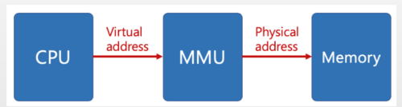

# 가상 메모리에 대해 설명해보세요.

## 면접용 답변

가상 메모리는 실제 물리 메모리보다 큰 메모리 공간을 프로세스에게 제공하는 메모리 관리 기법입니다. 
 
운영체제가 물리 메모리와 보조 저장장치를 연동하여 필요한 데이터만 메모리에 올리고, 나머지는 디스크에 두는 방식으로 동작합니다.
 
이를 통해 프로세스는 연속된 큰 메모리 공간을 사용하는 것처럼 보이지만, 실제로는 물리 메모리를 효율적으로 나눠쓸 수 있습니다. 
주요 이점으로는 프로세스 간 메모리 보호, 멀티태스킹 지원, 큰 프로그램 실행 가능 등이 있습니다.

 

## 개념 설명
### 1. 가상 메모리란?

프로세스의 일부만 메모리에 로드하고, 나머지는 디스크에 둔 상태로 프로세스를 실행하는 방식

사용자에게는 프로세스 전체가 메모리에 로드된 것처럼 보이지만, 실제로는 전체가 로드된 것이 아니어서 가상 메모리라고 부름

### 2. 가상 메모리의 장점

- 프로그램이 메모리 크기에 대한 제약을 덜 받을 수 있음
- 동시에 많은 프로그램을 실행하므로 CPU 이용률과 처리율을 높일 수 있음
- 필요한 영역만 메모리에 로드해 스와핑 횟수를 줄여서 프로그램 실행 속도를 높일 수 있음

### 3. 가상 메모리 작동 원리

**1. 프로세스는 가상 주소(Virtual Address) 를 사용함** 

운영체제는 각 프로세스에게 자기만의 주소 공간(가상 주소 공간) 을 제공하는데, 이 주소는 실제 RAM과는 완전히 별개의 논리적 공간임  
   예: 프로세스 A와 B가 둘 다 0x0000_0000 번지부터 시작해도 충돌 없음 → 이게 가능하게 해주는 게 가상 메모리 + MMU 구조

 

**2. 주소 변환: 가상 주소 → 물리 주소** 

이 작업은 MMU(Memory Management Unit) 가 수행, 아래의 3단계를 거침 

① TLB(Translation Lookaside Buffer) 조회 
  MMU는 가상 주소의 페이지 번호를 보고 먼저 TLB라는 고속 캐시에 질의
 TLB hit → 바로 물리 주소 얻고 끝
 TLB miss → 페이지 테이블 접근 필요

② 페이지 테이블(Page Table) 조회
 OS가 관리하는 페이지 테이블에서 해당 페이지 번호에 매핑된 프레임 번호를 조회
 이걸 통해 가상 주소의 페이지 번호를 물리 주소의 프레임 번호로 바꿈
  offset은 그대로 유지돼서 물리 주소 = 프레임 번호 + offset

③ 물리 메모리에 접근
변환된 물리 주소를 이용해 실제 메모리에서 데이터 읽기/쓰기 수행

 

**3. 페이지 부재(Page Fault)** 

하지만 해당 페이지가 아직 메모리에 없는 경우도 있음 → Page Fault 발생
즉, 페이지 테이블에 프레임 번호가 없거나 ‘not present’로 표시된 경우에 문제가 발생함 

처리 절차 
  ① OS가 디스크(보조 저장장치)에서 해당 페이지를 찾음
 ② 물리 메모리의 빈 공간 찾음
  → 없으면 페이지 교체 알고리즘(예: LRU)으로 기존 페이지 제거
  ③ 해당 페이지를 물리 메모리로 로드
  ④ 페이지 테이블 갱신
  ⑤ TLB도 갱신 (기존 엔트리 삭제 or 새로운 엔트리 추가)
  ⑥ 예외 복구 → 아까 중단된 명령어 다시 수행

 

### 4. 구현 기법

#### ✅ 페이징 

- 개념
  - 가상 메모리와 물리적 메모리를 동일한 크기의 작은 블록인 페이지(Page)와 프레임(Frame)으로 나누어 관리하는 방식
  - 페이지(Page): 가상 메모리를 일정한 크기로 나눈 작은 블록 
  - 프레임(Frame): 물리적 메모리를 페이지와 같은 크기로 나눈 작은 블록

- 작동 방식
  - 페이지 테이블이 각 가상 페이지와 물리 프레임 간의 매핑 정보를 저장 
  - 페이지 테이블의 정보는 MMU에 의해 사용됨 
  - 주소 변환:
    - 가상 주소 = 페이지 번호 + offset → 물리 주소 = 프레임 번호 + offset
-  장점
    - 외부 단편화 없음 
    - 구현이 단순함
- 단점 
  - 내부 단편화 발생 가능 
  - 페이지 테이블이 커질 수 있음 → 다단계 페이지 테이블 필요

> **정리**
   페이징 기법은 물리적 메모리를 효율적으로 사용할 수 있도록 하면서도 프로그램의 실행을 물리 메모리 크기에 구애받지 않고 가능하게 하는 강력한 메모리 관리 방법입니다. 페이지 테이블을 통해 가상 주소와 물리 주소를 매핑하고, 운영체제는 필요한 페이지만 메모리에 적재하여 성능을 최적화하며 메모리 보호 기능도 제공합니다.

 

#### ✅ 세그멘테이션  

- 개념
  - 가상 주소 공간을 논리적인 단위(세그먼트) 로 나누는 방식. 
  - 세그먼트는 크기가 가변적이며, 각각의 세그먼트는 코드, 데이터, 스택, 힙 등과 같은 논리적인 단위로 나눌 수 있음
  - 즉, 세그먼트는 프로그램의 의미적인 구분에 따라 나뉘어지며, 각 세그먼트는 별도로 메모리 공간을 할당받음
- 작동 방식 
  - 각 세그먼트는 시작 주소(base)와 크기(limit)로 구성
  - 주소 변환: 
   가상 주소 = 세그먼트 번호 + 오프셋 → 물리 주소 = base + offset
- 장점 
  - 사용자/프로그램 입장에서 더 직관적 
  - 논리적 구조를 잘 반영
- 단점 
  - 외부 단편화 발생 
  - 세그먼트마다 크기가 달라 메모리 할당이 복잡해짐
   

#### ✅ 세그먼트+페이징
- 개념
  - 각 세그먼트를 다시 페이지로 나눠서 관리 
  - 논리적 구조 + 효율적 메모리 사용을 모두 만족시키려는 절충안
- 작동 방식 
  - 주소는 세그먼트 번호 + 페이지 번호 + offset으로 구성 
  - MMU는 세그먼트 테이블과 페이지 테이블을 모두 사용
- 장점
  - 외부 단편화 문제 해결 
  - 논리적 구조 유지
- 단점 
  - 구조가 복잡하고 변환 비용이 큼

## 새끼 질문
- 페이지 교체란 무엇인가요?
- 페이지 부재(Page Fault)란 무엇이며, 어떻게 처리되나요?
- 페이징(Paging)과 세그먼테이션(Segmentation)의 차이점은 무엇인가요?

 

---
## Reference 
https://thebook.io/080367/0071/
https://explorer89.tistory.com/171